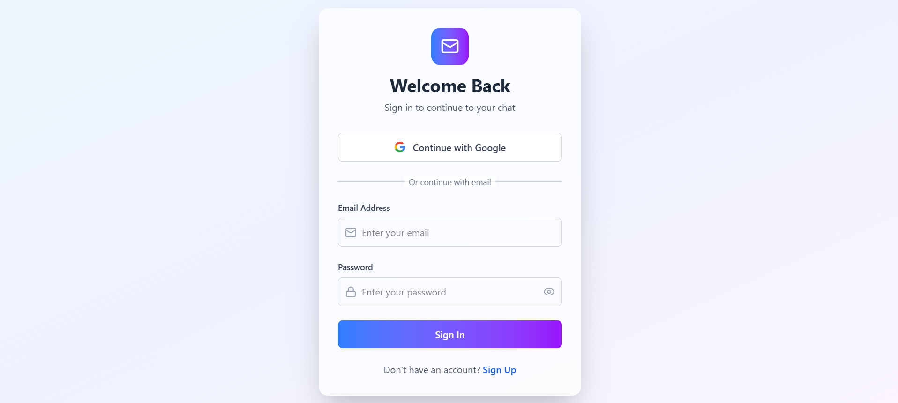
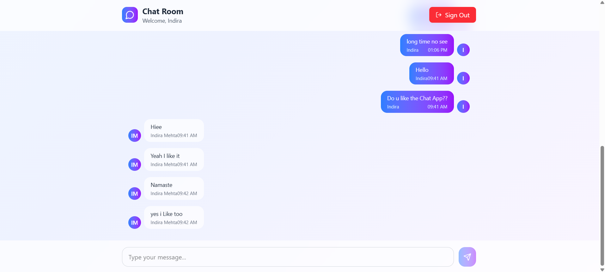

<div align="center"><div className="bg-gradient-to-r from-blue-500 to-purple-600 w-10 h-10 rounded-xl flex items-center justify-center">
              <MessageCircle className="w-6 h-6 text-white" />
            </div>
  <h1>💬 MegaChat App</h1>
  <p>A blazing-fast and beautiful real-time chat app built using <strong>React + Vite</strong>, powered by <strong>Firebase</strong>, styled with <strong>TailwindCSS</strong>.</p>
</div>

---

## 🚀 Tech Stack

**Frontend**
- ⚛️ React (with Vite)
- 🎨 Tailwind CSS
- 🔀 React Router DOM
- 🔔 React Toastify
- 🪄 Framer Motion

**Backend (Firebase)**
- 🔐 Firebase Authentication (Google + Email/Password)
- 💬 Firestore (real-time database)
- ☁️ Firebase SDK v9 Modular

---

## 🌟 Features
```
✅ Google and Email Auth (Firebase Auth)  
✅ Real-time Messaging (Firestore)  
✅ Auto Scroll-to-Bottom on New Messages  
✅ Mobile Responsive UI  
✅ Avatars using User Initials  
✅ Toast Notifications  
✅ Clean & Reusable Components  
✅ Gradient Animations + Lucid UI  
```


---


## 📁 Project Structure
```
📦 MegaChat/
├── 📂 public
├── 📂 src
│ ├── 📂 assets # Images & Screenshots
│ ├── 📂 components # UI Components (ChatRoom, AuthForm, etc.)
│ ├── 📂 context # Auth Context using Firebase
│ ├── 📂 lib # Firebase configuration
│ ├── App.jsx
│ ├── App.css
│ ├── index.css
│ ├── main.jsx
├── 📜 .env # Environment Variables
├── 📜 .gitignore
├── 📜 index.html
├── 📜 package.json
├── 📜 tailwind.config.js
├── 📜 vite.config.js
 ```

---

## 📸 Screenshots

| Auth Page | Chat Room |
|-----------|-----------|
|  |  |

---
<!-- 
 -----

## 🌟 Features
✅ Google & Email/Password Authentication
✅ Real-Time Chat with Firestore
✅ Auto Scroll to Bottom on New Messages
✅ Mobile Responsive
✅ User Initials Avatars
✅ Toast Notifications
✅ Component-Based Code
✅ Smooth UI Animations

--- -->


## 1. Clone the repository
git clone https://github.com/your-username/megachat.git

## 2. Navigate to the project
cd megachat

## 3. Install dependencies
npm install

## 4. Add your Firebase credentials to a `.env` file
VITE_FIREBASE_API_KEY=your_api_key
VITE_FIREBASE_AUTH_DOMAIN=your_auth_domain
VITE_FIREBASE_PROJECT_ID=your_project_id
VITE_FIREBASE_STORAGE_BUCKET=your_storage_bucket
VITE_FIREBASE_MESSAGING_SENDER_ID=your_sender_id
VITE_FIREBASE_APP_ID=your_app_id

## 5. Run the development server
npm run dev